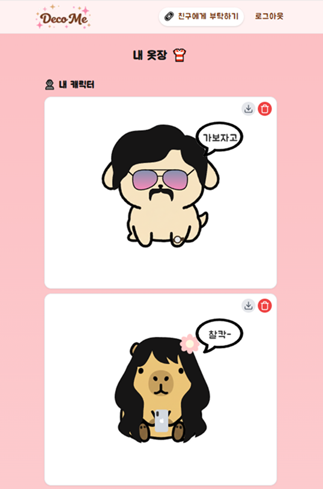

# deco-me

친구가 생각하는 나를 캐릭터로 만들어주는 참여형 웹 서비스

<p align="center">
  
  
</p>
---

## 📌 프로젝트 소개

**deco-me**는 사용자가 자신의 캐릭터를 직접 꾸민 뒤,
공유한 링크를 통해 친구들이  
**“친구가 생각하는 나”**를 캐릭터로 만들어주는 참여형 캐릭터 꾸미기 웹 서비스입니다.

별도의 앱 설치 없이 웹에서 바로 참여 가능하며,  
쉽게 캐릭터를 만들고 이미지로 저장하여 공유할 수 있습니다.

---

## ✨ 주요 기능

### 1. 캐릭터 꾸미기 (Editor)

- **Canvas 기반 렌더링**: `react-konva`를 사용하여 부드러운 캐릭터 조작 경험 제공
- **커스터마이징**:
  - 동물 캐릭터 선택 (카피바라, 고양이, 병아리 등)
  - 다양한 액세서리 추가, 이동, 크기 조절, 회전
  - 말풍선 텍스트 입력
- **모드 구분**:
  - `self` : 내가 나를 꾸미는 모드
  - `friend` : 친구가 나를 꾸미는 모드

### 2. 내 옷장 (Closet)

- **캐릭터 보관함**:
  - 내가 만든 캐릭터와 친구들이 선물해준 캐릭터 분리 조회
- **이미지 저장**:
  - `html2canvas`를 통해 완성된 캐릭터 카드를 이미지로 다운로드
- **관리 기능**:
  - 마음에 들지 않는 캐릭터 삭제 (Soft Delete)

### 3. 친구 초대 & 공유

- 캐릭터 생성 시 고유 초대 링크 생성 (`/editor?owner={id}`)
- 링크를 통해 로그인 없이도(또는 간편 로그인 후) 친구 꾸며주기 참여 가능

---

## 🛠 기술 스택

### Frontend

- **Framework**: Next.js (App Router)
- **Language**: TypeScript
- **Styling**: Tailwind CSS
- **State Management**: Zustand
- **Graphics**: Konva.js (react-konva)
- **Util**: html2canvas (이미지 저장)

### Backend (Serverless)

- **Supabase**
  - **Database**: PostgreSQL
  - **Auth**: Kakao Social Login

---

## 🧠 아키텍처 및 상태 관리

- **Canvas Architecture**:
  - `CharacterCanvas`: 공통 캔버스 로직 (뷰어/에디터 공용)
  - `AccessoryNode`: 조작 가능한 액세서리 객체 (Transformer 연결)
  - 고정된 캔버스 비율(300x300)로 일관된 사용자 경험 제공

- **State Management (Zustand)**:
  - `useCharacterStore`: 캐릭터 파츠(동물, 액세서리 위치/속성) 상태 관리
  - `useAuthStore`: 유저 세션 관리

---

## 🧱 데이터 구조

```sql
create table characters (
  id uuid primary key default gen_random_uuid(),
  owner_id text not null,      -- 캐릭터 주인의 ID
  created_by text not null,    -- 캐릭터를 만든 사람(본인 or 친구)의 ID
  created_by_name text,        -- 만든 사람 닉네임
  is_self boolean default false, -- 본인이 만들었는지 여부
  parts jsonb not null,        -- 캐릭터 파츠 데이터 (JSON)
  deleted_at timestamp with time zone -- Soft Delete
  created_at timestamp with time zone default now()
);
```

---

## 🚀 Getting Started

```bash
# 의존성 설치
npm install

# 개발 서버 실행
npm run dev
```
